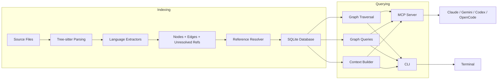
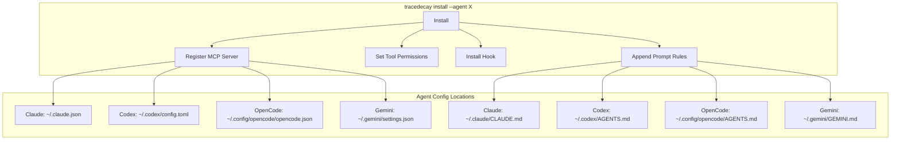

# TraceDecay Design Document

TraceDecay is a code intelligence tool that builds semantic knowledge graphs from source code.
It parses source files with tree-sitter, extracts symbols and relationships into a SQLite
database, and exposes the graph through a CLI and an MCP (Model Context Protocol) server.
The core insight is that AI coding agents waste tokens reading raw files when a pre-built
graph can answer most questions instantly.

## Architecture Overview

The system is structured as a pipeline: source files flow through extraction, resolution,
and storage, then get queried via the CLI or MCP server.



The binary (`src/main.rs`) serves as both the CLI frontend and MCP server entry point.
The library (`src/lib.rs`) exposes all internals so the CLI and server share the same code
paths without duplication.

## Module Map

```
src/
  main.rs             CLI entry point, subcommand dispatch
  lib.rs              Crate root, module declarations, lint config
  tracedecay.rs        TraceDecay facade -- the main public API
  branch.rs           Git branch resolution (current branch, default detection, merge-base)
  branch_meta.rs      Branch metadata persistence (branch-meta.json)
  config.rs           Per-project config (exclude patterns, limits)
  errors.rs           Error types (thiserror)
  sync.rs             Content hashing, stale/new/removed file detection
  user_config.rs      User-level config (~/.tracedecay/config.toml)
  cloud.rs            Cloudflare Worker counter, GitHub release checks
  global_db.rs        Cross-project token tracking (~/.tracedecay/global.db)

  extraction/         Tree-sitter based extractors (one per language)
    mod.rs            Extractor registry, feature-gated language modules
    complexity.rs     Cyclomatic complexity counting (language-configurable)
    rust_extractor.rs ... through qbasic_extractor.rs

  tree_sitter/        Vendored tree-sitter grammars
    cobol.rs          COBOL (no working crate on crates.io)
    protobuf.rs       Protobuf (version conflict with tree-sitter 0.26)

  db/                 SQLite persistence
    connection.rs     Database struct, WAL setup, checkpointing
    migrations.rs     Sequential schema migrations via PRAGMA user_version
    queries.rs        All SQL queries as async methods on Database

  resolution/         Cross-file symbol resolution
    resolver.rs       Matches unresolved references to known nodes

  graph/              Higher-level graph algorithms
    traversal.rs      BFS/DFS, callers/callees, impact radius, path finding
    queries.rs        Dead code detection, circular deps, file dependencies

  context/            AI-ready context assembly
    builder.rs        Builds TaskContext from a natural language query
    formatter.rs      Markdown and JSON output formatters

  vectors/            Embedding storage and brute-force similarity search
    search.rs         Store/query/delete vectors, cosine similarity

  mcp/                Model Context Protocol server
    server.rs         McpServer: stdio JSON-RPC loop, lifecycle
    tools.rs          37 tool definitions and dispatch
    transport.rs      JSON-RPC request/response/error types

  agents/             Agent integration (install/uninstall/doctor)
    mod.rs            Agent trait, registry, shared helpers, git hooks
    claude.rs         Claude Code: MCP in ~/.claude.json, hooks, permissions
    codex.rs          Codex CLI: MCP in ~/.codex/config.toml, AGENTS.md
    opencode.rs       OpenCode: MCP in ~/.config/opencode/opencode.json, ~/.config/opencode/AGENTS.md
    gemini.rs         Gemini CLI: MCP in ~/.gemini/settings.json, GEMINI.md
```

## Core Data Model

The graph has three primary entities stored in SQLite tables.

**Nodes** represent code symbols. Each node has:

- A deterministic ID (content-addressed hash of file path + name + kind)
- A `NodeKind` enum with 50+ variants spanning all supported languages
  (Function, Method, Struct, Class, Enum, Trait, Interface, Field, etc.)
- Source location (file, start line, end line)
- Metadata: signature, visibility, docstring, body hash, line count
- Complexity metrics: branches, loops, returns, max nesting, unsafe blocks

**Edges** represent relationships between nodes:

| EdgeKind     | Meaning                            |
|--------------|------------------------------------|
| Contains     | Parent contains child (file->fn)   |
| Calls        | Function/method calls another      |
| Uses         | Symbol references another symbol   |
| Implements   | Type implements trait/interface     |
| TypeOf       | Field/param has a type reference    |
| Returns      | Function returns a type            |
| Inherits     | Class extends another              |
| Overrides    | Method overrides a parent method   |
| Imports      | File imports from another          |
| AnnotatedBy  | Symbol annotated by annotation     |

**Files** track indexing state per source file:

- Path, content hash (SHA-256), language, size, last-indexed timestamp
- Content hashing enables incremental sync: only re-extract changed files

## Indexing Pipeline

### 1. File Discovery

`TraceDecay::index_all` walks the project tree, filters by extension (language support)
and config exclude globs. If `git_ignore` is enabled, it additionally filters through
`.gitignore` rules via the `ignore` crate.

### 2. Extraction

Each source file is dispatched to a language-specific extractor based on file extension.
Extractors use tree-sitter to parse the file into a concrete syntax tree, then walk it
to produce an `ExtractionResult` containing:

- **Nodes**: every symbol found in the file
- **Edges**: intra-file relationships (contains, calls, uses, implements, etc.)
- **Unresolved references**: call sites and type references that name symbols
  potentially defined in other files

The extractor architecture is stateless: `XxxExtractor::extract_source(path, source)`
takes a file path and source string, returns nodes and edges. An internal `ExtractionState`
accumulates results during the tree walk, tracks scope nesting for containment edges,
and collects unresolved references.

Complexity metrics are computed during extraction using a language-configurable walker
(`ComplexityConfig`) that counts branches, loops, nesting depth, unsafe blocks, and
unchecked calls in each function body.

### 3. Reference Resolution

After all files are extracted, the `ReferenceResolver` runs a second pass. It loads all
nodes into memory, builds a name-to-node index, and attempts to match each unresolved
reference to a known node. Matched references become typed edges (Calls, Uses, TypeOf,
etc.) that create cross-file connections in the graph.

### 4. Storage

Nodes, edges, and file records are bulk-inserted into SQLite via `Database::insert_nodes`
and `Database::insert_edges`, which use batched prepared statements for performance.
The database runs in WAL mode with `busy_timeout = 5000ms` to handle concurrent access
from the MCP server and git post-commit hooks.

### 5. Incremental Sync

`TraceDecay::sync` compares the current file system state against the stored file records
using SHA-256 content hashes. It identifies three sets:

- **New files**: on disk but not in DB, need full extraction
- **Modified files**: hash mismatch, re-extract and replace
- **Removed files**: in DB but not on disk, delete nodes and edges

Only changed files are re-extracted. After re-extraction, reference resolution runs
again on the full graph to pick up any new cross-file edges.

## Database Layer

The database uses `libsql` (a SQLite fork by Turso) for async support. The schema
is managed by sequential migrations tracked via `PRAGMA user_version`.

Key schema features:

- **FTS5** full-text search index on node names for fuzzy symbol search
- **Covering indexes** on edges `(source_id, kind)` and `(target_id, kind)` for
  fast traversal in both directions
- **Content-addressed node IDs** enable deduplication and stable references
- **WAL mode** with `NORMAL` synchronous for concurrent read/write safety

The `queries.rs` module (~1600 lines) implements all data access as async methods
on `Database`. Complex analytical queries (god classes, inheritance depth, coupling)
use CTEs and window functions to avoid pulling large datasets into Rust.

## Graph Algorithms

`graph/traversal.rs` provides BFS and DFS traversal with configurable edge kinds,
max depth, and direction. Built on top of it:

- **Callers/callees**: follow Calls edges upstream/downstream
- **Impact radius**: BFS from a node following all edge kinds to find the blast radius
- **Call graph**: bidirectional expansion from a function
- **Type hierarchy**: follows Implements and Inherits edges
- **Path finding**: BFS shortest path between two nodes

`graph/queries.rs` provides higher-level analyses:

- **Dead code detection**: nodes with zero incoming Calls/Uses edges (excluding files)
- **Circular dependencies**: Tarjan's SCC algorithm on file-level import edges
- **File dependencies/dependents**: which files a file depends on or is depended upon by

## Context Builder

The context builder (`context/builder.rs`) is the key integration point for AI agents.
Given a natural language task description, it:

1. Extracts symbol names from the query using heuristics (camelCase splitting, etc.)
2. Searches for each extracted symbol via FTS5 full-text search
3. Searches for each agent-provided keyword (the `extra_keywords` field)
4. Expands relevant nodes by following edges to include callers, callees, and types
5. Reads source code snippets for the top-ranked nodes
6. Assembles a `TaskContext` with ranked symbols, their code, and relationship summaries

The output can be formatted as markdown (for humans / LLM prompts) or JSON (for
programmatic consumption).

### Semantic Search: Keywords vs Embeddings

The primary search mechanism is FTS5 with BM25 scoring, which matches against
node names, qualified names, signatures, and docstrings. This works well when
query terms appear literally in the code, but fails when concepts don't match
symbol names (e.g. "authentication" won't find `login()` unless a docstring
mentions it).

Rather than embedding models, tracedecay uses **agent-driven keyword expansion**.
The `tracedecay_context` MCP tool accepts a `keywords` array where the calling
agent provides synonyms:

```json
{
  "task": "how does authentication work",
  "keywords": ["login", "session", "credential", "token", "jwt"]
}
```

Each keyword runs as an independent FTS5 query, and results are merged with the
main query's results (deduplicated by node ID).

**Why keywords instead of embeddings:**

| | Agent keywords | Local embeddings |
|---|---|---|
| Indexing cost | Zero | ~30s per 1,000 nodes (ONNX inference) |
| Model dependency | None | ~50MB model download |
| Query latency | ~1ms per keyword (FTS5 index hit) | ~200ms (brute-force cosine) |
| Binary size impact | None | +15-20 MB (ONNX runtime) |
| Conceptual match quality | Depends on agent's domain knowledge | Better for truly alien naming |
| Works without an LLM | No (needs an agent to provide keywords) | Yes (standalone) |

The trade-off: if the codebase uses naming conventions the agent can't predict
(e.g. `guardianGateway` for authentication), keywords miss while embeddings
would catch it via distributional semantics. In practice, the agent is an LLM
that understands programming conventions well enough to supply good synonyms
for the vast majority of cases.

## MCP Server

The MCP server (`mcp/server.rs`) runs over stdio using JSON-RPC 2.0. It implements
the Model Context Protocol lifecycle:

1. **initialize**: returns server capabilities and tool list
2. **tools/list**: returns the 36 available tools with JSON Schema input definitions
3. **tools/call**: dispatches to `handle_tool_call` which routes by tool name

The server is stateless between calls (each call queries the database independently).
It tracks basic statistics (call counts, tokens saved per tool) for the `tracedecay_status`
tool.

### Tool Categories

The 37 MCP tools fall into several categories:

| Category        | Tools                                                    |
|-----------------|----------------------------------------------------------|
| Search          | search, context, node, files, diff_context               |
| Navigation      | callers, callees, impact, affected                       |
| Analysis        | complexity, dead_code, god_class, circular, coupling     |
| Metrics         | rank, hotspots, largest, distribution, inheritance_depth |
| Quality         | doc_coverage, unused_imports, recursion                  |
| Refactoring     | rename_preview, similar, module_api                      |
| Git/CI          | changelog, commit_context, pr_context                    |
| Quality Scan    | simplify_scan, test_map, type_hierarchy                  |
| Porting         | port_status, port_order                                  |
| Branching       | branch_search, branch_diff                               |
| Status          | status                                                   |

Each tool is defined in `mcp/tools.rs` with a JSON Schema for its parameters.
`handle_tool_call` deserializes the arguments, calls the appropriate `TraceDecay`
method, and formats the result.

## Agent Integration

The `agents/` module implements the `Agent` trait, providing `install`, `uninstall`,
and `healthcheck` operations for each supported coding agent. The registry in `mod.rs`
maps string IDs to agent implementations.

Each agent's install routine:

1. Registers the MCP server in the agent's config file
2. Sets up tool permissions / auto-approval where supported
3. Installs a PreToolUse hook (Claude Code only) to block redundant file reads
4. Appends prompt rules to the agent's instructions file



The `doctor` command runs healthchecks across all (or a specific) agent,
verifying that the MCP server is registered, permissions are correct, hooks
are installed, and prompt rules are present.

## Language Support Tiers

Languages are organized into feature-gated tiers to control binary size and
compile time:

| Tier   | Languages                                                         | Feature Flag |
|--------|-------------------------------------------------------------------|--------------|
| Lite   | Rust, Go, Java, Scala, TypeScript/JS, Python, C, C++, Kotlin, C#, Swift | always on |
| Medium | Dart, Pascal, PHP, Ruby, Bash, Protobuf, PowerShell, Nix, VB.NET | `medium`     |
| Full   | Lua, Zig, Obj-C, Perl, Batch, Fortran, COBOL, MSBasic2, GWBasic, QBasic | `full` (default) |

Two grammars (COBOL and Protobuf) are vendored as C source compiled via `build.rs`
because their crate counterparts are either missing or depend on incompatible
tree-sitter versions. The FFI shims live in `src/tree_sitter/`.

## Token Tracking

TraceDecay tracks how many tokens it saves compared to raw file reads. Each MCP tool
call estimates the tokens that would have been consumed by reading the relevant files,
subtracts the size of the tool's response, and accumulates the difference in the
per-project database.

A global database at `~/.tracedecay/global.db` aggregates totals across all projects
(an existing legacy `~/.tokensave/` directory is still honored as a fallback).
An opt-in worldwide counter (Cloudflare Worker) lets users contribute their totals
anonymously. Upload is best-effort with 2-second timeouts and never blocks the CLI.

## Concurrency Model

The system uses `tokio` for async I/O but most work is CPU-bound (tree-sitter parsing)
or SQLite-bound. Key concurrency points:

- The MCP server processes one JSON-RPC request at a time (single stdio stream)
- The git post-commit hook runs `tracedecay sync` in the background (`&`). `sync` requires an existing database -- it will not create one. This prevents the hook from silently bootstrapping indexes in repos that were never initialized with `tracedecay init`.
- SQLite WAL mode + busy timeout handles concurrent access gracefully
- Version checks and counter uploads run on background threads during `sync`

## Build and Distribution

- **Cargo**: `cargo install tracedecay`
- **Homebrew**: custom tap with prebuilt bottles (macOS ARM64, Linux x86_64)
- **Scoop**: custom bucket with prebuilt Windows x86_64 zip
- **GitHub Releases**: prebuilt archives for all platforms

The release workflow (`release.yml`) builds binaries for 4 targets, packages them
as archives and Homebrew bottles, then updates the Homebrew tap and Scoop bucket
repos automatically.
