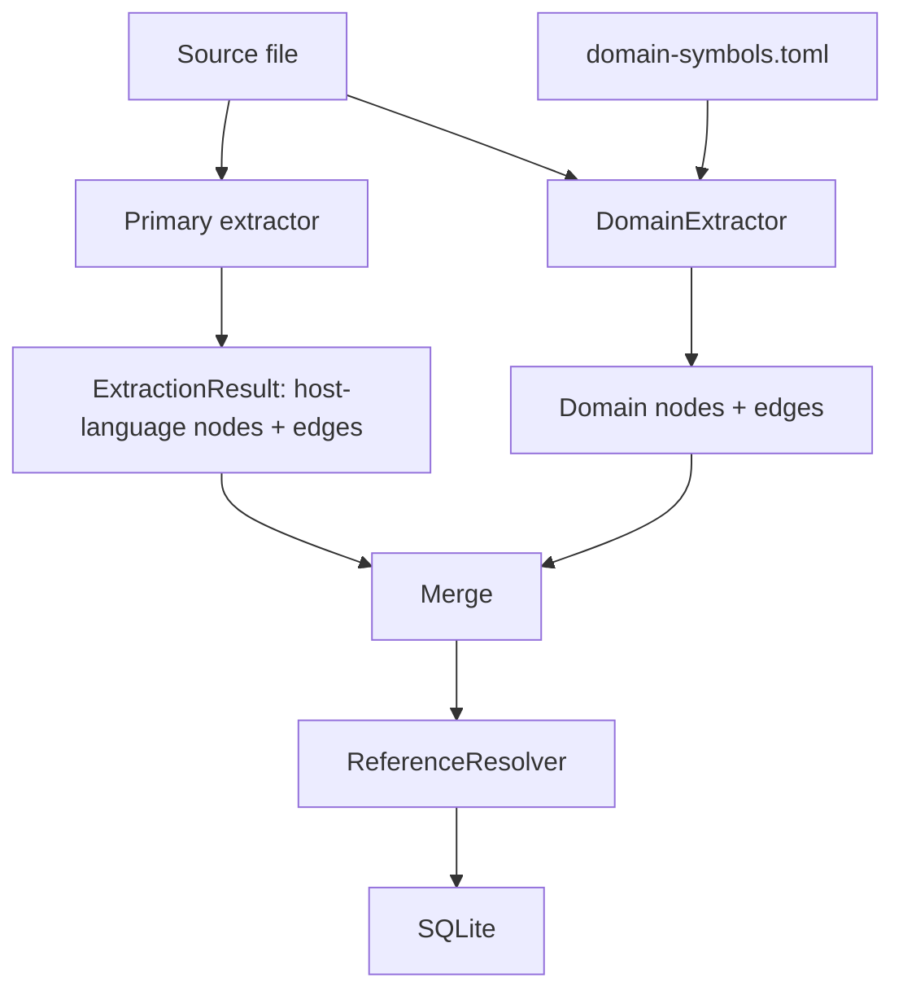

# Domain Symbol Extractors

Configurable, project-local rules that promote string literals and structural patterns into first-class graph nodes. Motivated by [issue #48](https://github.com/ScriptedAlchemy/tokensave/issues/48).

---

## The general problem

Many software systems encode their primary semantic domain as *data* inside a host language rather than as language-level constructs. The host language parser sees the structure correctly, but the domain meaning is hidden inside string arguments, match arm patterns, or array literals.

| Domain | Host language | Registration pattern | Invisible symbol |
|---|---|---|---|
| Lisp interpreter | Rust | `interp.define("transpose-regions", ...)` | Elisp primitive name |
| HTTP router | TS / Go | `router.get("/api/users/:id", handler)` | Route pattern |
| CLI framework | Python / Rust | `app.command("build", build_fn)` | Command name |
| Event bus | JS / Rust | `bus.on("document.saved", cb)` | Event name |
| Plugin registry | Any | `registry.register("formatter.rust", ...)` | Plugin ID |
| Feature flags | Any | `flags.enabled("new-checkout-flow")` | Flag name |
| State machine | Any | `machine.transition("idle", "running", ev)` | State / event names |
| Test framework | JS / Python | `describe("when user logs in", fn)` | Test group name |
| i18n | Any | `t("common.button.save")` | Translation key |
| ORM / migration | Any | `migration("add_users_table", fn)` | Migration name |

In all of these cases, asking tokensave "where is X implemented?" or "what calls Y?" misses the real registration because the meaningful name is inside a string literal. A standard tree-sitter extractor sees the host language correctly and nothing else.

---

## Three structural forms

Most domain-symbol patterns fall into one of three shapes, regardless of host language:

**Form 1 — Call-site registration**
```rust
interp.define("transpose-regions", LispObject::primitive("transpose-regions"));
router.get("/api/users/:id", handle_user);
```
A function or method call where one argument is the domain symbol name.

**Form 2 — Match / switch arm dispatch**
```rust
match name {
    "transpose-regions" => { ... }
    "car" => { ... }
}
```
A match or switch statement where string literal patterns are domain symbol names.

**Form 3 — Array / slice declaration**
```rust
let stub_names = ["foo", "bar", "baz"];
const COMMANDS: &[&str] = &["build", "test", "deploy"];
```
An array or slice literal where each element is a domain symbol name, often used as a backlog or registry list.

---

## Architecture

Domain extraction is a second pass that runs *after* the primary tree-sitter extractor and augments its `ExtractionResult` with additional nodes and edges. The primary extractor is unchanged.



Domain nodes are merged into the same `ExtractionResult` before the reference resolver runs, so they participate in cross-file edge resolution on the same footing as host-language nodes.

---

## Rule schema

Rules live in `.tokensave/domain-symbols.toml` at the project root. Each `[[rule]]` block describes one pattern family.

```toml
# .tokensave/domain-symbols.toml

[layer]
name  = "elisp-primitive"  # unique identifier for this set of rules
files = ["src/**/*.rs"]    # glob — only these files are scanned

[[rule]]
name        = "interp-define"
form        = "call"           # call | match | array
pattern     = '$OBJ.define($NAME, $VALUE)'
name_arg    = "$NAME"          # which capture holds the domain symbol name
target_arg  = "$VALUE"         # optional: capture that resolves to another node
emit_node   = "domain_symbol"  # NodeKind to emit (see §Graph integration)
emit_edges  = [
    { kind = "registers", from = "enclosing_function", to = "$NAME" },
    { kind = "implements", from = "$NAME", to = "$VALUE" },
]

[[rule]]
name        = "match-dispatch"
form        = "match"
pattern     = 'match $DISPATCH { $NAME => $BODY }'
name_arg    = "$NAME"
emit_node   = "domain_symbol"
emit_edges  = [
    { kind = "dispatches", from = "enclosing_function", to = "$NAME" },
]

[[rule]]
name        = "stub-array"
form        = "array"
pattern     = 'let $VAR: $TYPE = [$ITEMS]'
var_filter  = ["stub_names", "alias_to_ignore"]  # only arrays with these variable names
emit_node   = "domain_symbol"
emit_edges  = [
    { kind = "registers", from = "enclosing_function", to = "$NAME" },
]
```

### Key fields

| Field | Required | Description |
|---|---|---|
| `form` | yes | Structural form: `call`, `match`, `array` |
| `pattern` | yes | Structural pattern in the chosen pattern language (see §Pattern matching) |
| `name_arg` | yes | Which capture group holds the domain symbol name (a string literal) |
| `target_arg` | no | Optional capture that resolves to another node in the graph |
| `emit_node` | yes | `NodeKind` string for emitted domain nodes |
| `emit_edges` | no | List of edges to emit; `from`/`to` accept capture refs or `enclosing_function` / `enclosing_file` |
| `var_filter` | no | For `array` form: restrict to arrays with these variable names |
| `files` | layer-level | Glob filter; rules never run on non-matching files |

---

## Pattern matching: three approaches and their tradeoffs

### Option A — Tree-sitter query language (`.scm` syntax)

Tree-sitter ships with a structured query language used by Neovim, Helix, and GitHub for syntax highlighting and navigation. Queries are S-expressions that match the concrete syntax tree:

```scheme
(call_expression
  function: (field_expression field: (field_identifier) @method (#eq? @method "define"))
  arguments: (arguments (string_literal) @name . _))
```

| | |
|---|---|
| **Pro** | Runs in-process on the same parser already used by extractors; zero new dependencies; extremely precise (matches exact node types in the CST); the same grammar is already loaded |
| **Pro** | No subprocess overhead; compatible with the incremental sync model |
| **Con** | S-expression syntax is unfamiliar to most developers |
| **Con** | Each rule must be written per language (a Rust query does not match Go code for the same conceptual pattern) |
| **Con** | Capturing nested or optional structure is verbose |

### Option B — ast-grep pattern language

ast-grep uses a pattern language based on concrete code templates, where `$NAME` captures any matching node:

```
$OBJ.define($NAME, $VALUE)
```

tokensave already shells out to `ast-grep` for `tokensave_ast_grep_rewrite`. ast-grep is language-aware (the same pattern matches the correct AST nodes across formatting variants).

| | |
|---|---|
| **Pro** | Familiar to anyone who has written a code pattern; the pattern looks like the code it matches |
| **Pro** | Cross-language: the same template works across languages that share call-site syntax |
| **Con** | External binary required; subprocess per file during sync is slow at scale |
| **Con** | Optional dependency — users without ast-grep installed get silent no-ops |
| **Con** | Less precise than tree-sitter queries: `$NAME` matches any expression, not just string literals |

### Option C — Regex with structural scope

Simple regex anchored to a structural context (e.g., "this regex must match inside a function call argument"):

```toml
pattern = 'interp\.define\("(?P<name>[^"]+)"'
scope   = "function_call"
```

| | |
|---|---|
| **Pro** | Zero new dependencies; universally understood |
| **Pro** | Fastest to execute (plain regex scan, no parse tree) |
| **Con** | Structure-blind: fragile to multi-line patterns, comments, and formatting |
| **Con** | No concept of "enclosing function" or "this is an argument vs. a string in a comment" |
| **Con** | Cannot express Form 2 (match arm) or Form 3 (array) without complex, brittle patterns |

### Recommendation: two-tier hybrid

Use **tree-sitter queries for structural matching** (in-process, fast, precise) and **a simple string extraction step** to pull the domain symbol name from the matched string literal node. The pattern field in the rule schema is a tree-sitter query by default; ast-grep syntax is supported as an opt-in for users who prefer it and have it installed.

```toml
[[rule]]
pattern_lang = "treesitter"   # default; "ast-grep" is the alternative
pattern = '...'
```

This keeps the hot path (sync over thousands of files) fully in-process while giving users the option of the more approachable ast-grep syntax for ad-hoc rule authoring.

---

## Graph integration

### NodeKind

Add `NodeKind::DomainSymbol` to the existing enum. Domain symbol nodes store:

| Field | Value |
|---|---|
| `kind` | `"domain_symbol"` |
| `name` | The extracted string (e.g. `"transpose-regions"`) |
| `qualified_name` | `{layer}::{name}` (e.g. `"elisp-primitive::transpose-regions"`) |
| `file_path` | File where the registration was found |
| `line` | Line of the registration call |
| `metadata` | JSON blob: `{ "layer": "elisp-primitive", "rule": "interp-define" }` |

Domain symbol nodes are returned by `tokensave_search`, `tokensave_context`, and `tokensave_dead_code`. Existing MCP tools that filter by node kind accept `"domain_symbol"` as a valid filter value.

### EdgeKind: open-ended custom edges

The DB schema stores edge `kind` as `TEXT`. The `EdgeKind` Rust enum covers built-in kinds, but custom domain edges (e.g. `"registers"`, `"dispatches"`, `"aliases_to"`) are stored as plain strings and round-tripped through the existing `EdgeKind::from_str` fallback. No schema migration is required.

Graph traversal tools (`tokensave_callers`, `tokensave_impact`, `tokensave_affected`) follow domain edges by default, making domain symbols fully reachable in impact analysis.

### Stable node IDs for cross-file resolution

The critical property: if `interp.define("foo", ...)` appears in `init.rs` and `match name { "foo" => ... }` appears in `dispatch.rs`, both rules must produce the *same* node so that edges from both files attach to a single graph node.

Domain symbol node IDs are derived from the layer and name, not the file:

```
domain:{layer_name}:{symbol_name}
```

e.g. `domain:elisp-primitive:transpose-regions`

This means two rules in the same layer that extract the same string automatically converge on one node. Edges from different files accumulate on that node, enabling queries like "show me every file that references this domain symbol."

---

## Activation and distribution

### Project-local rules (primary use case)

`.tokensave/domain-symbols.toml` at the project root. Rules are private to the project; they are not committed alongside the source unless the project author chooses to.

### Rule packs (shareable)

Reusable TOML files installed to `~/.tokensave/domain-packs/`. A pack is just a `domain-symbols.toml` with a pack name in its header:

```toml
[pack]
name    = "actix-web-routes"
version = "1.0.0"
```

Installed via a future `tokensave domain install actix-web-routes` command (v2). Until then, users copy pack files manually.

### Built-in packs (shipped with tokensave)

Common framework patterns can ship as optional built-ins, off by default, activated in `user_config.toml`:

```toml
[domain]
packs = ["express-routes", "pytest-describe", "click-commands"]
```

Candidate built-in packs: Express/Fastify routes, Rails routes, Click CLI commands, Pytest `describe`/`it`, Actix-web handlers.

---

## Performance

- **File filter first.** The glob from `[layer].files` is evaluated before any parsing; non-matching files are skipped entirely.
- **Shared parse tree.** The primary extractor already parses each file with tree-sitter. The domain extractor should reuse the same `Tree` rather than re-parsing. This requires threading the parse tree through `ExtractionResult` or running domain extraction inside the primary extractor's call.
- **Incremental.** Domain extraction re-runs only when a file's content hash changes — the same condition that triggers primary re-extraction. No separate staleness tracking is needed.
- **In-process for tree-sitter rules.** No subprocess, no IPC. Expected overhead: < 5 % on top of primary extraction for typical rule sets.
- **ast-grep rules are batched.** If ast-grep rules are present, tokensave runs one `ast-grep` invocation per changed file rather than one per rule, passing all patterns as a YAML config file via `--config`.

---

## Open questions

1. **Dead code semantics.** Should a domain symbol registered via `interp.define("foo", ...)` suppress a dead-code warning for `foo` even when no Rust function named `foo` exists? The domain layer is the only "caller." This requires `tokensave_dead_code` to understand that a `domain_symbol` node with incoming `registers` edges is not dead.

2. **Parametric names.** How to handle `/api/users/:id` — is the pattern itself the symbol, or should tokensave normalise it to `/api/users/{id}` for matching purposes? Route matching is inherently parametric; symbol identity is not obvious.

3. **Cross-layer edges.** Can a domain symbol in one layer reference a symbol in another? For example, an HTTP route pointing to a CLI command name. The ID scheme supports this (`domain:http-route:/build` → `domain:cli-command:build`) but the rule schema has no syntax for it yet.

4. **Shared parse tree.** Reusing the tree-sitter `Tree` from the primary extractor is the right performance call but requires changing the `LanguageExtractor::extract` signature or the `LanguageRegistry` dispatch logic. This is the main implementation complexity in the first version.

5. **Rule authoring UX.** There is no interactive way to test a rule against a file today. A `tokensave domain test <file>` command that prints matched nodes and edges without writing to the DB would significantly reduce the authoring feedback loop.

6. **Conflict resolution.** If two rules (or a rule and a primary extractor) emit a node with the same ID, which one wins? Last-write wins is simplest; a `priority` field in the rule is the clean solution but adds schema complexity.
