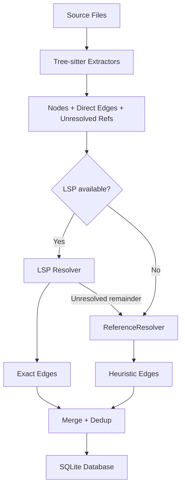

# LSP Integration Design

Optional LSP (Language Server Protocol) pass during sync to upgrade cross-file edge accuracy. Tree-sitter remains the primary extraction engine; LSP servers, when available, replace heuristic name-matching with semantically exact definition resolution.

## Motivation

Today, cross-file edges are resolved by `ReferenceResolver`, which matches unresolved ref names against a cache of known node names and qualified names. This is a string-matching heuristic. It works well for unique names but breaks down in common scenarios:

- **Overloaded names.** Three structs named `Config` in different modules. The resolver picks the one in the same file or the first match, which is often wrong.
- **Method dispatch.** `validator.check(input)` could resolve to any `check` method. Without type information, the resolver guesses based on proximity.
- **Re-exports and aliases.** `use crate::auth::User as AuthUser` means the call site says `AuthUser` but the definition says `User`. The resolver tries suffix matching but can still miss.
- **Cross-crate / cross-package references.** Calls into dependencies are unresolvable from AST alone since the definition lives outside the project tree.

LSP servers have full semantic understanding of the code: type information, trait resolution, module paths, dependency graphs. A single `textDocument/definition` request on a call site returns the exact file, line, and column of the target.

## Architecture



The key property is **graceful degradation**: every language works without LSP installed. LSP is a quality upgrade, not a requirement.

### Pipeline Changes

The current sync pipeline in `tracedecay.rs` is:

1. Scan files
2. Parallel tree-sitter extraction (rayon)
3. Collect all nodes, edges, unresolved refs
4. `ReferenceResolver::resolve_all()` -- heuristic name matching
5. Dedup edges
6. Bulk insert into SQLite

The new pipeline inserts a step between 3 and 4:

1. Scan files
2. Parallel tree-sitter extraction (rayon)
3. Collect all nodes, edges, unresolved refs
4. **LSP resolution pass** (for languages with a running server)
5. `ReferenceResolver::resolve_all()` on **remaining** unresolved refs
6. Dedup edges
7. Bulk insert into SQLite

Step 4 partitions unresolved refs by language, sends batch definition requests to each running LSP server, and converts successful responses into resolved edges. Refs that LSP cannot resolve (external dependencies, dynamic dispatch, server timeout) fall through to the existing heuristic resolver in step 5.

## LSP Client Infrastructure

### `src/lsp/` Module Layout

```
src/lsp/
    mod.rs              LspManager: lifecycle, server registry, feature detection
    client.rs           LspClient: JSON-RPC transport, request/response, stdin/stdout
    protocol.rs         LSP message types (initialize, didOpen, definition, shutdown)
    resolver.rs         LspResolver: batch unresolved refs -> edges via LSP
    adapters/
        mod.rs          LspAdapter trait, adapter registry
        rust.rs         rust-analyzer adapter
        go.rs           gopls adapter
        clangd.rs       clangd adapter (C/C++/ObjC)
        zig.rs          zls adapter
        lua.rs          lua-language-server adapter
        typescript.rs   typescript-language-server adapter
        python.rs       pyright adapter
        php.rs          intelephense adapter
```

### LspAdapter Trait

Each language adapter knows how to detect, spawn, and configure its LSP server:

```rust
pub trait LspAdapter: Send + Sync {
    /// Languages this adapter handles (matching LanguageExtractor::language_name).
    fn languages(&self) -> &[&str];

    /// Binary name(s) to search for on $PATH.
    fn server_binaries(&self) -> &[&str];

    /// Check whether the server binary is available.
    fn detect(&self) -> Option<PathBuf> {
        self.server_binaries()
            .iter()
            .find_map(|bin| which::which(bin).ok())
    }

    /// Command and arguments to spawn the server in stdio mode.
    fn spawn_command(&self, binary: &Path) -> Command;

    /// Extra initialization options for the `initialize` request.
    fn init_options(&self, project_root: &Path) -> Option<Value> {
        let _ = project_root;
        None
    }

    /// Whether this server requires a project manifest to provide
    /// useful cross-file resolution (e.g., Cargo.toml, go.mod).
    fn requires_manifest(&self) -> Option<&str> {
        None
    }

    /// Estimated time for the server to index a workspace, used for
    /// timeout calibration. Servers that do background indexing (rust-analyzer,
    /// gopls) need a grace period after initialization before definition
    /// requests return accurate results.
    fn index_grace_period(&self) -> Duration {
        Duration::from_secs(5)
    }
}
```

### LspClient

Handles the JSON-RPC 2.0 transport over stdin/stdout:

```rust
pub struct LspClient {
    child: Child,
    writer: BufWriter<ChildStdin>,
    reader: BufReader<ChildStdout>,
    next_id: AtomicI64,
    pending: HashMap<i64, oneshot::Sender<Value>>,
}
```

Core operations:

- `initialize(root_uri, capabilities)` -- sends `initialize`, waits for response, sends `initialized` notification
- `did_open(uri, language_id, text)` -- notifies server about a file
- `definition(uri, line, column)` -- sends `textDocument/definition`, returns `Location` or `LocationLink`
- `shutdown()` -- graceful shutdown sequence

The client uses a background reader task that dispatches responses to pending request channels. Requests have a configurable timeout (default 5s per request, 30s for initialization).

### LspManager

Manages server lifecycle across a sync run:

```rust
pub struct LspManager {
    adapters: Vec<Box<dyn LspAdapter>>,
    clients: HashMap<String, LspClient>,  // keyed by language name
}
```

On `start(project_root)`:

1. For each registered adapter, check if the binary is on `$PATH`
2. If a manifest is required (e.g. `Cargo.toml`), check it exists in `project_root`
3. Spawn the server, run the initialize handshake
4. Wait for the index grace period (or until the server signals readiness)
5. Log which servers started successfully; skip failures silently

On `resolve(unresolved_refs)`:

1. Group refs by language
2. For each language with a running server, open the relevant files via `didOpen`
3. Send `textDocument/definition` for each ref's location
4. Convert successful responses to resolved edges
5. Return remaining unresolved refs for fallback resolution

On `stop()`:

1. Send `shutdown` + `exit` to each running server
2. Kill any server that doesn't exit within 3 seconds

### LspResolver

Bridges between tracedecay's `UnresolvedRef` and LSP protocol:

```rust
pub struct LspResolver<'a> {
    manager: &'a LspManager,
    nodes: &'a [Node],
    node_index: HashMap<(String, u32), String>,  // (file_path, start_line) -> node_id
}
```

For each unresolved ref, the resolver:

1. Sends `textDocument/definition` at `(ref.file_path, ref.line, ref.column)`
2. Receives a target location `(target_file, target_line, target_column)`
3. Looks up the target in the node index by file path and line range
4. If found, emits an `Edge { source: ref.from_node_id, target: node_id, kind: ref.reference_kind }`
5. If the target is outside the project (external dependency), discards the ref (cannot create an edge to a non-indexed node)

#### Batching and Parallelism

LSP servers process requests sequentially (the protocol allows interleaving but most servers don't pipeline). To maximize throughput:

- Files are opened in batches before sending definition requests
- Requests for the same file are grouped to avoid redundant `didOpen` calls
- Multiple LSP servers (one per language) run concurrently
- A per-server concurrency limit of 1 is enforced (sequential requests to each server, parallel across servers)

## Server Adapters

### Phase 1: Standalone Binaries (No Runtime)

These servers are single binaries with no runtime dependency. They cover 7 tracedecay languages and are the initial implementation targets.

| Language | Server | Binary | Manifest | Grace Period | Notes |
|---|---|---|---|---|---|
| Rust | rust-analyzer | `rust-analyzer` | `Cargo.toml` | 10s | Needs Cargo.toml for cross-file; works single-file without |
| Go | gopls | `gopls` | `go.mod` | 5s | Falls back to GOPATH mode without go.mod |
| C | clangd | `clangd` | `compile_commands.json` (optional) | 3s | Uses heuristics without compile_commands.json |
| C++ | clangd | `clangd` | `compile_commands.json` (optional) | 3s | Same server as C |
| Obj-C | clangd | `clangd` | `compile_commands.json` (optional) | 3s | Same server as C/C++ |
| Zig | zls | `zls` | None | 2s | Works on individual files |
| Lua | lua-language-server | `lua-language-server` | None | 3s | Scans workspace directory |

Implementation detail: clangd handles C, C++, and Objective-C through a single adapter. The adapter maps all three language names to the same server instance, avoiding triple spawning.

### Phase 2: Node.js-Based (High Value)

These require Node.js on `$PATH` but cover the highest-traffic languages after the Phase 1 set.

| Language | Server | Binary | Manifest | Grace Period | Notes |
|---|---|---|---|---|---|
| TypeScript | typescript-language-server | `typescript-language-server` | `tsconfig.json` (optional) | 5s | Also handles JavaScript |
| JavaScript | typescript-language-server | `typescript-language-server` | None | 5s | Same server as TypeScript |
| Python | pyright-langserver | `pyright-langserver` | None | 5s | Best broken-code tolerance of any LSP |
| PHP | intelephense | `intelephense` | None | 3s | Free tier supports go-to-definition |

The adapter checks for `node` on `$PATH` before attempting to spawn. If Node.js is not installed, these languages fall back to heuristic resolution silently.

### Phase 3: Heavy Runtimes (JVM, .NET, SDK)

Deferred to a future iteration. These servers have long initialization times (10-60s), require build systems to be configured, and need runtime-specific detection logic.

| Language | Server | Runtime | Estimated Init Time |
|---|---|---|---|
| Java | jdtls | JVM 17+ | 15-60s |
| Kotlin | kotlin-language-server | JVM | 15-45s |
| Scala | Metals | JVM + Coursier | 30-120s |
| C# | OmniSharp | .NET SDK | 10-30s |
| Dart | dart language-server | Dart SDK | 5-15s |
| Swift | sourcekit-lsp | Swift toolchain | 5-15s |

These are better suited to a long-running model (e.g. embedded in the MCP server process) where the LSP server stays alive between syncs rather than being spawned per-sync.

### No LSP Available

These tracedecay languages have no usable LSP server. They continue to use heuristic resolution only.

Batch, GWBasic, MSBasic2, QBasic, QuickBasic.

Remaining languages (Bash, Nix, PowerShell, VB.NET, Pascal, Protobuf, Perl, Ruby, Fortran, COBOL, GLSL, Dockerfile) have LSP servers of varying maturity but are deferred until there's user demand.

## Edge Provenance

To distinguish LSP-resolved edges from heuristic-resolved edges (useful for confidence scoring and debugging), the `Edge` struct gains an optional field:

```rust
pub struct Edge {
    pub source: String,
    pub target: String,
    pub kind: EdgeKind,
    pub line: Option<u32>,
    pub resolved_by: Option<ResolutionSource>,  // new
}

pub enum ResolutionSource {
    Direct,     // emitted directly by the extractor (Contains, DerivesMacro, etc.)
    Heuristic,  // resolved by ReferenceResolver name matching
    Lsp,        // resolved by LSP textDocument/definition
}
```

The `resolved_by` field is stored in the `edges` table as a nullable TEXT column. Existing edges (from direct extraction) have `resolved_by = 'direct'`. The migration adds the column with a default of `'direct'` for existing rows.

This enables future queries like "show me all call edges that were only heuristically resolved" (candidates for inaccuracy) and quality metrics comparing LSP vs heuristic resolution rates.

## Configuration

### Per-Project (`tracedecay.toml`)

```toml
[lsp]
enabled = true              # default: true
timeout_secs = 30           # max total time for LSP pass; 0 = unlimited
per_request_timeout_ms = 5000  # per-definition request timeout

# Disable specific servers
[lsp.disable]
rust = false
go = false
clangd = false
typescript = false
python = false
```

### CLI Flags

```
tracedecay sync              # LSP pass runs if servers are available
tracedecay sync --no-lsp     # skip LSP pass entirely
tracedecay sync --lsp-only   # skip heuristic resolution, only use LSP
tracedecay index --no-lsp    # full reindex without LSP
```

### Environment Variables

```
TRACEDECAY_LSP=0             # disable LSP globally (equivalent to --no-lsp)
TRACEDECAY_LSP_TIMEOUT=30    # override timeout
```

The legacy `TOKENSAVE_*` variable names are still honored as a fallback when the
`TRACEDECAY_*` equivalents are unset.

## Performance Considerations

### Sync Time Impact

The LSP pass adds time to sync. Measured against the current heuristic-only pipeline:

| Scenario | Current | With LSP (estimated) | Delta |
|---|---|---|---|
| Small project (500 files, Rust) | ~2s | ~12s | +10s (rust-analyzer init) |
| Medium project (2K files, mixed) | ~5s | ~15-20s | +10-15s |
| Large project (10K files, mixed) | ~15s | ~30-45s | +15-30s |

The dominant cost is server initialization, not per-request latency. Once initialized, definition requests typically complete in <10ms each.

### Mitigation Strategies

**MCP-kept servers.** When the tracedecay MCP server is running, LSP servers can be kept alive between incremental syncs driven by the embedded watcher. The initialization cost is paid once; subsequent syncs only pay per-request costs. This changes the delta from +10-30s to +1-5s for incremental syncs.

**Parallel server startup.** Phase 1 servers (all standalone binaries) can be spawned concurrently. A project using Rust + Go + C++ pays the init cost of the slowest server (rust-analyzer, ~10s), not the sum.

**Selective file opening.** Only files containing unresolved refs need to be opened via `didOpen`. For incremental syncs where only 3 files changed, only those files (and their import targets) need to be sent to the server.

**Early termination.** If the LSP pass exceeds `timeout_secs`, remaining unresolved refs are handed to the heuristic resolver. Partial LSP resolution is better than none.

**Skip when no refs.** If a sync produces zero unresolved refs (e.g., a documentation-only change), the LSP pass is skipped entirely.

## Testing Strategy

### Unit Tests

- `LspClient`: mock server using an in-process stdin/stdout pipe that speaks JSON-RPC. Test initialize handshake, definition requests, timeout handling, malformed responses.
- `LspResolver`: given a set of nodes and mock LSP responses, verify correct edge creation, fallback behavior, and deduplication.
- Each adapter: verify `detect()`, `spawn_command()`, `init_options()` produce correct values.

### Integration Tests

- Spawn a real `rust-analyzer` against `tests/fixtures/` Rust project. Verify that cross-file call edges are resolved correctly.
- Same for `gopls` and a Go fixture project.
- Test graceful degradation: run sync with `TRACEDECAY_LSP=0` and verify output matches current behavior exactly.

### CI Considerations

- Phase 1 servers (rust-analyzer, gopls, clangd, zls) can be installed in CI.
- lua-language-server is a ~50MB binary; cache it.
- Phase 2 servers (Node.js based) need a Node.js installation step.
- Integration tests that require specific LSP servers should be gated behind feature flags or CI environment detection.

## Rollout Plan

### Phase 1: Standalone Servers

Target: 7 languages (Rust, Go, C, C++, Obj-C, Zig, Lua)

Work breakdown:
1. `src/lsp/client.rs` -- JSON-RPC transport (~400 lines)
2. `src/lsp/protocol.rs` -- LSP message types (~300 lines)
3. `src/lsp/mod.rs` -- LspManager lifecycle (~300 lines)
4. `src/lsp/resolver.rs` -- UnresolvedRef -> Edge via LSP (~250 lines)
5. Adapter trait + 5 adapters (rust, go, clangd, zig, lua) (~500 lines)
6. Pipeline integration in `tracedecay.rs` (~100 lines)
7. Edge provenance: `ResolutionSource` + DB migration (~50 lines)
8. Config: `--no-lsp`, `tracedecay.toml` section (~80 lines)
9. Tests (~600 lines)
10. Documentation updates

Estimated total: ~2,600 lines, ~1 week.

### Phase 2: Node.js Servers

Target: +4 languages (TypeScript, JavaScript, Python, PHP)

Work breakdown:
1. Node.js detection utility (~30 lines)
2. 3 adapters (typescript, python, php) (~300 lines)
3. Tests (~300 lines)

Estimated total: ~630 lines, ~3-4 days.

### Phase 3: MCP Server Integration

Target: keep LSP servers alive between syncs via the embedded MCP watcher.

Work breakdown:
1. `LspManager` integration with the MCP server's project watcher (~200 lines)
2. Server health checking and restart logic (~150 lines)
3. Memory-bounded file cache (avoid re-opening unchanged files) (~200 lines)

Estimated total: ~550 lines, ~3-4 days.

### Phase 4: Heavy Runtime Servers

Target: Java, Kotlin, Scala, C#, Dart, Swift. Deferred until Phase 3 (MCP integration) is complete, since these servers are only practical as long-running processes.

## Appendix: Broken-Code Tolerance Ranking

How well each LSP server resolves definitions when the project has errors, missing dependencies, or incomplete builds. This determines how useful the LSP pass is in practice, since users often run `tracedecay sync` on code that doesn't compile.

| Rank | Server | Tolerance | Notes |
|---|---|---|---|
| 1 | Pyright (Python) | Excellent | Designed for untyped/partially-typed code |
| 2 | rust-analyzer | Excellent | Salsa-based incremental analysis; partial results |
| 3 | LuaLS | Excellent | Dynamic language; graceful flow analysis |
| 4 | gopls | Good | Soft-error type checking mode |
| 5 | typescript-language-server | Good | tsserver handles incomplete code well |
| 6 | intelephense (PHP) | Good | Loose typing helps |
| 7 | clangd | Moderate | Missing headers cause cascading failures |
| 8 | zls | Good | Zig's incremental compilation model helps |
| 9 | sourcekit-lsp (Swift) | Poor-Moderate | SourceKit crashes on malformed code |
| 10 | jdtls (Java) | Moderate | ECJ is tolerant; missing deps are not |
| 11 | kotlin-language-server | Poor-Moderate | Kotlin compiler is less forgiving |
| 12 | Metals (Scala) | Moderate | Missing deps are fatal |
| 13 | OmniSharp (C#) | Moderate | Roslyn handles partial code |
