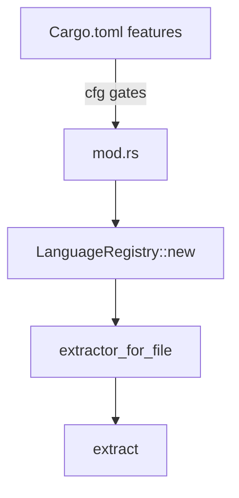
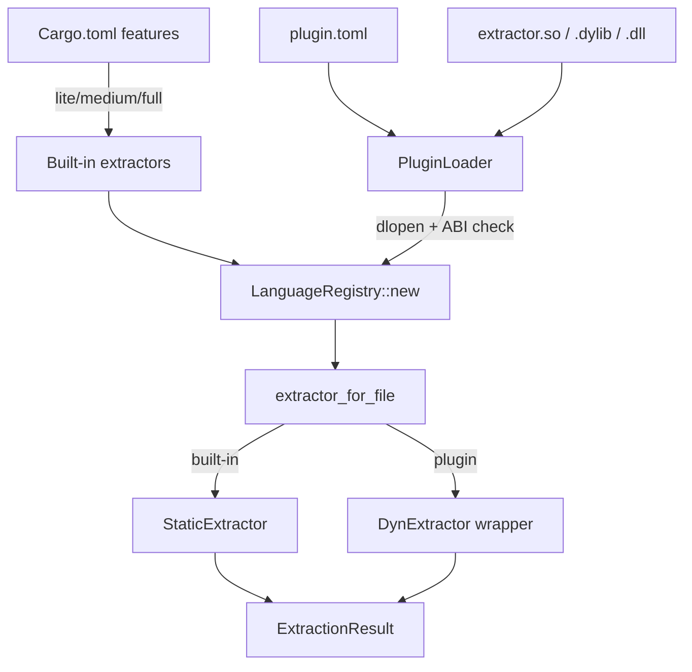

# Plugin System Design

Replace compile-time, feature-gated language extractors with dynamically loaded plugins so that new languages can be added without recompiling or releasing the main binary.

---

## Problem with the current model

Every language extractor is gated on a Cargo feature (`lang-lua`, `lang-zig`, …) and compiled into the binary at build time via `tokensave-large-treesitters`. Adding a language today means:

1. Adding a grammar crate dependency to `tokensave-large-treesitters` and cutting a release.
2. Writing an extractor in `src/extraction/`, adding `#[cfg(feature = "…")]` gates in `mod.rs`, and updating `Cargo.toml`.
3. Releasing a new version of `tracedecay` itself.

This is a tight coupling between the extractor author, the grammar maintainer, and the `tracedecay` release cycle. Community contributions have to go through this bottleneck even when the grammar is already a well-maintained crate on crates.io.

---

## Goals

- Add language support at runtime — no recompile, no new release.
- Community plugins ship as standalone artefacts.
- Incremental: built-in languages stay compiled in; the plugin system is purely additive.
- Language metadata is driven by a well-known external schema rather than hardcoded in Rust source.

---

## Language metadata: the GitHub linguist schema

GitHub publishes [`languages.yml`](https://github.com/github/linguist/blob/master/lib/linguist/languages.yml) — the authoritative, community-maintained catalogue of programming languages. Each entry carries:

| Field | Example | Use in tracedecay |
|---|---|---|
| `extensions` | `[".ex", ".exs"]` | Primary dispatch in `extractor_for_file` |
| `filenames` | `["Dockerfile"]` | Exact filename match |
| `interpreters` | `["elixir"]` | Shebang detection (future) |
| `type` | `programming` / `markup` / `data` / `prose` | Skip `data` and `prose` by default |
| `group` | `C` | Reuse a base extractor for dialects |
| `aliases` | `["elixir", "ex"]` | Human-readable names in output |

A plugin manifest declares its language using a subset of these fields. tracedecay also ships a bundled snapshot of `languages.yml` for file-type reporting and IDE hints, updated on each release.

### Example plugin manifest (`plugin.toml`)

```toml
[plugin]
name        = "tracedecay-elixir"
version     = "1.2.0"
api_version = 1          # bumped on breaking ABI changes

[language]
name         = "Elixir"
extensions   = [".ex", ".exs"]
filenames    = ["mix.exs"]
interpreters = ["elixir"]
type         = "programming"
```

---

## Architecture

### Current (compile-time)



### Target (plugin-aware)



`LanguageRegistry::new()` loads built-ins first, then calls `PluginLoader::discover()` to find and link plugins. Plugins that declare an extension already claimed by a built-in extractor take precedence (opt-in override), unless disabled in config.

---

## Plugin binary format (v1)

Plugins ship as native shared libraries (`.so` on Linux, `.dylib` on macOS, `.dll` on Windows). The grammar is statically linked inside the dylib — no separate grammar file to manage.

### C ABI exported from the dylib

```c
/* ABI version this plugin was compiled against */
uint32_t tracedecay_plugin_api_version(void);

/* Null-terminated list of file extensions (without leading dot) */
const char* const* tracedecay_extensions(void);

/* Human-readable language name */
const char* tracedecay_language_name(void);

/* Main extraction entry point.
   Returns a JSON-encoded ExtractionResult; caller must free with tracedecay_free. */
const char* tracedecay_extract(const char* file_path, const char* source, size_t source_len);

/* Free a string returned by tracedecay_extract */
void tracedecay_free(const char* ptr);
```

### Plugin SDK crate

A `tracedecay-plugin-sdk` crate (published separately) provides:

- A `#[tracedecay_plugin]` proc-macro that generates the C ABI glue from a normal `LanguageExtractor` impl.
- Safe Rust wrappers around the JSON serialisation / deserialisation boundary.
- A `grammar!` macro that embeds the tree-sitter grammar and calls `ts_provider::language`.

Authors implement the same `LanguageExtractor` trait they would for a built-in, then add two lines:

```rust
use tracedecay_plugin_sdk::tracedecay_plugin;

#[tracedecay_plugin]
pub struct ElixirExtractor;

impl LanguageExtractor for ElixirExtractor { … }
```

---

## Plugin discovery

tracedecay searches the following directories in order, stopping at the first match for a given extension:

1. `$TRACEDECAY_PLUGIN_PATH` (colon-separated, same convention as `PATH`; the legacy `TOKENSAVE_PLUGIN_PATH` is still honored as a fallback)
2. `.tracedecay/plugins/` in the current project root (an existing `.tokensave/plugins/` is still honored as a fallback)
3. `~/.tracedecay/plugins/`
4. Platform config dir (`%APPDATA%\tracedecay\plugins` on Windows, `~/Library/Application Support/tracedecay/plugins` on macOS)

Each plugin lives in its own subdirectory:

```
~/.tracedecay/plugins/
  tracedecay-elixir/
    plugin.toml          # manifest
    tracedecay_elixir.so  # extractor + grammar (platform-specific name)
```

### Plugin commands (future)

```bash
tracedecay plugin install tracedecay-elixir   # download from registry, verify checksum
tracedecay plugin list                        # installed plugins + languages covered
tracedecay plugin disable tracedecay-elixir   # add to ignore list in config
```

---

## Migration path for built-in languages

Built-in extractors are not removed. The three tiers (lite / medium / full) remain the defaults for zero-setup installs. The plugin system is a fourth tier that activates at runtime.

Long-term, thin languages from the `full` tier (COBOL, GW-BASIC, etc.) could graduate to optional plugins, shrinking the default binary. That migration is separate from this design and requires measuring whether binary size is actually a pain point.

---

## `ExtractionResult` serialisation

The plugin boundary uses JSON to avoid Rust ABI instability across compiler versions. `ExtractionResult` is already `serde::Serialize / Deserialize`. The host calls `tracedecay_extract`, deserialises the JSON, and feeds the result into the same graph-building pipeline as built-in extractors. The overhead is one `serde_json::from_str` call per file — negligible compared to tree-sitter parsing.

If benchmarks show the JSON round-trip is hot, a future ABI v2 can switch to a length-prefixed binary format (MessagePack or a hand-rolled layout), but the same proc-macro generates it transparently from the SDK side.

---

## Security model (v1)

- Plugins run in-process with full trust. No sandboxing.
- `tracedecay plugin install` verifies a SHA-256 checksum declared in the manifest against a future plugin registry.
- Config option `plugins.enabled = false` disables all plugin loading (useful in CI or locked environments).
- A `plugins.allow = ["tracedecay-elixir"]` allowlist can restrict which plugins are loaded.

WASM sandboxing (via `wasmtime`) is a plausible v2 model: the grammar and extractor compile to a single `.wasm`, and the host runs it inside a Wasmtime store with memory isolation. This would add cross-platform portability (one `.wasm` instead of three platform dylibs) at the cost of a heavier runtime dependency and ~2–5× slower parse throughput.

---

## Open questions

1. **Grammar distribution.** Should plugins bundle the compiled tree-sitter grammar (current proposal) or reference a grammar by crate + version and have tracedecay compile/link it? Bundling is simpler; referencing avoids duplicating grammars when multiple plugins use the same language family.

2. **Registry.** Where do plugins live before an official registry exists? crates.io is a natural host (the `.so` can be embedded in a Rust crate), but cargo-downloading and extracting a dylib is non-standard. A GitHub release asset download is simpler for v1.

3. **ABI stability.** The JSON boundary sidesteps Rust ABI instability, but `api_version` still needs to bump whenever `ExtractionResult`, `Node`, or `Edge` adds a required field. A Protobuf/Flatbuffer schema for `ExtractionResult` would make backwards-compatible evolution explicit.

4. **Dialect reuse.** The `group` field in `languages.yml` lets a plugin declare "I handle TypeScript-flavoured extraction for `.svelte` files." A base-extractor delegation mechanism would let plugins call into a built-in and post-process the result rather than reimplementing from scratch.
