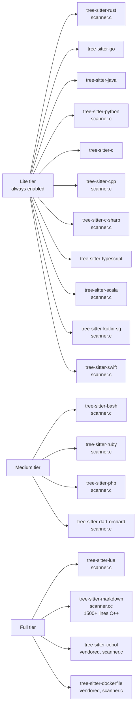
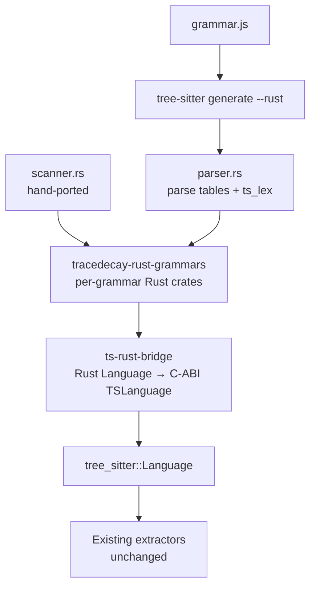

# Rust Parser Migration

Migrate tracedecay's tree-sitter grammar dependencies from C/C++ generated parsers to pure-Rust generated parsers, eliminating an entire class of `abort()`-based failures. Motivated by [issue #50](https://github.com/ScriptedAlchemy/tracedecay/issues/50), follow-up to [#49](https://github.com/ScriptedAlchemy/tracedecay/issues/49).

---

## The problem

Every grammar tracedecay consumes is currently produced by `tree-sitter generate` in its default C mode and compiled by `cc-rs` at build time. Two concrete consequences:

1. **C-level aborts bypass Rust panic handling.** Issue #49 was a `assert()` in the vendored `tree-sitter-markdown` C++ scanner that called `abort()` on certain autolink constructs. `std::panic::catch_unwind` can recover from Rust panics; it cannot recover from `SIGABRT`. The v4.2.1 fix worked around this by setting `CFLAGS=-DNDEBUG` to compile assertions out, but the underlying fragility (a C/C++ scanner can crash the process by any path: assertion, segfault, stack overflow, calling `std::terminate`) is unchanged.

2. **C toolchain dependency.** `cargo install tracedecay` requires a working C/C++ compiler on the user's machine. For users on minimal containers or locked-down corporate machines, this is a real install barrier.

A pure-Rust parser fixes both: panics are catchable, and there is no C compilation step.

---

## What's available

[`ScriptedAlchemy/tree-sitter`](https://github.com/ScriptedAlchemy/tree-sitter) is a fork of the upstream tree-sitter with a `--rust` flag added to `tree-sitter generate` (commit [`6d5c136a`](https://github.com/ScriptedAlchemy/tree-sitter/commit/6d5c136a)). It emits a `parser.rs` file targeting [`ScriptedAlchemy/tree-sitter-runtime`](https://github.com/ScriptedAlchemy/tree-sitter-runtime), a `no_std` crate that defines the runtime types (`Language`, `Lexer` trait, `ParseAction`, `ExternalScanner` vtable, etc.).

The fork includes a parity test (`crates/generate/tests/rust_c_parity.rs`) that compares constants, symbol arrays, and structural exports between the C and Rust renderers across five inline grammars and any file-based grammar passed via `GRAMMAR_JSON_PATH`. This gives some confidence that the table data is structurally equivalent.

What the fork does **not** provide:

- A bridge from `tree_sitter_runtime::Language` to `tree_sitter::Language` (the C-ABI type that `Parser::set_language` consumes).
- A Rust scanner generator. The `--rust` flag generates the parser tables and lex function only; external scanners remain hand-written in whatever language the upstream grammar author chose.

Both of these are this project's job.

---

## Inventory: what tracedecay actually needs



Counting the work:

| Category | Grammars | Effort per grammar |
|---|---|---|
| No external scanner | Go, Java, C, TypeScript | Just regenerate; minimal port effort |
| Small scanner (one or two tokens) | Bash, Ruby, Lua, Dart, PHP | ~100–300 lines to port |
| Medium scanner | Rust, Python, C++, C#, Scala, Kotlin, Swift | ~300–800 lines to port |
| Large scanner | **Markdown** | ~1500 lines C++, the urgent one |
| Vendored | Cobol, Dockerfile | Live in `tokensave-large-treesitters/vendor/`; we already control these |

The migration value is highest for grammars where `--rust` is a clean win (top row) and for markdown (the bug source). The middle rows are real engineering work that has to be amortized across each grammar.

---

## Architecture

### Two new crates



**`ts-rust-bridge`** is the load-bearing piece. It exposes one function:

```rust
pub fn to_ts_language(rust_lang: &'static tree_sitter_runtime::Language) -> tree_sitter::Language;
```

The conversion is non-trivial because the runtime's `Language` is a Rust struct with `&'static str` symbol names and Rust function signatures, while `tree_sitter::Language` wraps a C-ABI `TSLanguage` whose layout is defined by `lib/include/tree_sitter/parser.h` in tree-sitter itself.

**`tracedecay-rust-grammars`** is a workspace of per-grammar crates, one per language. Each crate contains the `parser.rs` (committed, generated) and, when applicable, a hand-ported `scanner.rs`. Each exports `pub fn language() -> tree_sitter::Language` ready to plug into the existing extractors.

### Bridge internals

The bridge needs to solve four mechanical problems.

**1. Memory layout.** `TSLanguage` is an internal C struct, not part of tree-sitter's public C API. Its field order and types are defined in `lib/src/parser.h` and may change between tree-sitter versions. We pin a specific tree-sitter version in `Cargo.toml`, and the bridge defines a `#[repr(C)]` Rust mirror of `TSLanguage` that matches that version exactly. A CI test runs `cargo doc --document-private-items` against the pinned tree-sitter and grep-asserts the field list to catch upstream drift.

**2. Symbol names.** The C struct expects `*const *const c_char` (null-terminated). The runtime gives us `&'static [&'static str]` (length-prefixed Rust slices). At first call, the bridge allocates and leaks one `Vec<CString>` plus one `Vec<*const c_char>` per language and stores the latter behind a `OnceLock`. Leaked memory is fine: there is exactly one per supported language, the lifetime is the process lifetime, and the alternative (heap-managed C strings) needs lifetime gymnastics no extractor would benefit from.

**3. Lex function thunk.** The Rust lex signature is `fn(&mut dyn Lexer, StateId) -> bool`. The C signature is `extern "C" fn(*mut TSLexer, TSStateId) -> bool`. The thunk wraps the C `TSLexer*` in a Rust `Lexer`-impl adapter that forwards each method call to the C function pointers in the lexer struct, then calls the Rust lex function:

```rust
extern "C" fn lex_thunk(c_lexer: *mut TSLexer, state: u16) -> bool {
    let mut adapter = CLexerAdapter::new(c_lexer);
    LANG.lex_fn(&mut adapter, state)
}
```

`CLexerAdapter::lookahead()` reads the field directly; `advance()` calls `(*c_lexer).advance(c_lexer, skip)`; etc. The thunk is per-grammar because `extern "C"` functions cannot capture; a macro generates one alongside each language definition.

**4. External scanner vtable.** Grammars with `scanner.rs` provide an `ExternalScanner` struct whose `create`/`destroy`/`scan`/`serialize`/`deserialize` are Rust function pointers. C expects equivalent `extern "C"` function pointers in the `external_scanner` field of `TSLanguage`. Each scanner method gets its own thunk that wraps the C lexer (as above for `scan`) and forwards.

A worked example for a no-scanner grammar:

```rust
// In tracedecay-rust-grammars/go/src/lib.rs
mod parser;  // generated by `tree-sitter generate --rust`

pub fn language() -> tree_sitter::Language {
    static C_LANG: OnceLock<*const ts_rust_bridge::TSLanguage> = OnceLock::new();
    let ptr = *C_LANG.get_or_init(|| {
        ts_rust_bridge::synthesize(parser::language(), bridge_funcs!(parser))
    });
    unsafe { tree_sitter::Language::from_raw(ptr) }
}
```

The `bridge_funcs!` macro generates the per-grammar `extern "C"` thunks pointing at `parser::ts_lex`, `parser::ts_lex_keywords`, and (when scanner present) the scanner methods.

### Scanner ports

For each scanner-having grammar, the C/C++ scanner gets translated function-by-function to a Rust module that implements:

```rust
pub struct Scanner {
    // grammar-specific state
}

impl Scanner {
    pub fn new() -> Self { ... }
    pub fn scan(&mut self, lexer: &mut dyn Lexer, valid_symbols: &[bool]) -> bool { ... }
    pub fn serialize(&self, buf: &mut [u8; SERIALIZATION_BUFFER_SIZE]) -> u32 { ... }
    pub fn deserialize(&mut self, buf: &[u8]) { ... }
}
```

Most scanners fall into two structural patterns:

- **Indentation/heredoc trackers** (Python, Ruby, Bash, Lua): a small stack of integers, simple character classification. Direct Rust port is straightforward.
- **Delimiter/context machines** (Markdown, C++ raw strings, Scala): more involved state, but mechanical translation of C++ classes to Rust structs works.

For markdown specifically, the scanner has:
- A block-context stack (`std::vector<BlockContext>`).
- An inline-delimiter list (`std::list<InlineDelimiter>`).
- Several lookup tables and predicate functions that are already pure functions.

Translation strategy: keep the file structure the same (one Rust module per `*.cc`/`*.h` pair), preserve function names, port the data structures using `Vec` and `VecDeque`. The asserts that aborted in #49 become `debug_assert!` (compiled out in release) plus an early-return-false on the inverse condition. The scanner returns `false` to signal "this token is not present", which the parser engine handles as an empty external lex result.

---

## Testing strategy

**Parity, not just compilation.** A regression suite parses a corpus of real-world files (the tracedecay codebase itself, the tree-sitter test fixtures, plus a curated set of "weird" markdown files including the autolink construct from #49) with both the C grammar and the Rust grammar, then asserts:

1. Both produce the same node count.
2. Both produce the same root S-expression (after node name normalization).
3. Neither produces an `ERROR` node where the other doesn't.

This is the same approach as the fork's `rust_c_parity.rs`, extended from generator-level parity to runtime-level parity.

**Fuzz both implementations.** A short `cargo-fuzz` target feeds random byte strings into both parsers and checks that neither panics, aborts, or produces divergent trees. This is cheap insurance against hand-port bugs in the scanners.

**No test on first port.** A grammar is not migrated until its parity test is green on at least 1000 real files of that language.

---

## Phasing

### Phase 1: bridge crate

Build `ts-rust-bridge` end-to-end with one trivial grammar (a hand-written 5-token toy grammar checked into the crate's tests). Goal: prove the C-ABI synthesis works, the `OnceLock` initialization is sound, and `tree_sitter::Parser::set_language` accepts the synthesized language.

Risk: tree-sitter's `TSLanguage` ABI is private and version-dependent. Mitigation: pin tree-sitter version in `Cargo.toml`, document the pinned ABI, add a CI check.

### Phase 2: scanner-free grammars

Migrate Go, Java, C, and TypeScript. Each is a one-day task:

1. Run `tree-sitter generate --rust` on the upstream `grammar.js`.
2. Commit the generated `parser.rs` to `tracedecay-rust-grammars/{lang}/src/`.
3. Wire the bridge.
4. Run the parity suite.
5. Update the corresponding extractor in `src/extraction/` to use the new `language()` function.

End of phase 2: ~1/3 of tracedecay's grammars are pure Rust. The build no longer needs a C compiler when only those languages are enabled.

### Phase 3: small scanners

Bash, Ruby, Lua, Dart, PHP. Roughly 100-300 lines of port work each. Order by grammar size and tracedecay usage frequency (Bash first; it has the most tracedecay users hitting it).

### Phase 4: medium scanners

Rust, Python, C++, C#, Scala, Kotlin, Swift. ~300-800 lines each. The Rust grammar deserves special care because tracedecay's own dogfooding depends on it.

### Phase 5: markdown

The reason this whole project exists. The C++ scanner is a few thousand lines but most of it is mechanical state-machine code. Plan two weeks. The parity suite must include the exact reproducer from issue #49 plus a corpus of CommonMark-ambiguous documents.

### Phase 6: cleanup

- Drop `tokensave-large-treesitters` / `-medium` / `-lite` dependencies.
- Drop the `[env]` block in `.cargo/config.toml`.
- Drop `safe_extract`'s `catch_unwind` if the parity suite has been clean for a release cycle. (Or keep it; the cost is one closure per file and the safety value is real.)
- Issue #49 stays closed but the comment is updated to point at the Rust port.

---

## Decisions deferred

**Whether to publish the per-grammar crates to crates.io.** They are useful to other Rust projects that want pure-Rust grammars, but maintaining 20+ public crates is real overhead. Likely answer: yes for the no-scanner ones (low maintenance), maybe for the others. Decide after Phase 2.

**Whether to upstream the `--rust` flag to the official tree-sitter repo.** The fork has been working since March 2026; an upstream PR would let the broader ecosystem benefit. Out of scope for this migration but worth proposing once the bridge is proven.

**Whether to write a Rust scanner generator.** All scanner ports here are hand-written. A long-term ambition is to generate them from a higher-level DSL, but every existing scanner is an irreducible state machine encoded by a human, so generation is unlikely to pay off.

---

## Cost estimate

| Phase | Calendar time | Why |
|---|---|---|
| 1: Bridge | 1 week | Mostly correctness work, lots of unsafe |
| 2: Scanner-free grammars | 1 week | Mostly mechanical |
| 3: Small scanners | 2 weeks | 5 grammars × few days |
| 4: Medium scanners | 4 weeks | 7 grammars × a few days |
| 5: Markdown | 2 weeks | One large but bounded scanner |
| 6: Cleanup | 3 days | Dependency removal, doc updates |

Total: roughly 10 weeks for one engineer. The bridge and markdown are the riskiest pieces; phases 2 through 4 are well-bounded once the bridge is solid.

This is a substantial investment. The break-even is roughly: zero `abort()`-class bugs from grammars going forward, no C toolchain dependency, and clean Rust stack traces when grammar bugs do happen. Whether that justifies 10 weeks depends on how many issues #49-shaped reports show up; if it's one per release, the math is solid.

---

## What this does NOT change

The tree-sitter parser engine itself (the LR table walker in `tree-sitter`'s C code) remains in C. We're replacing the *language description* (parse tables + lex code), not the parsing algorithm. A pure-Rust tree-sitter parser engine is a separate, much larger project that nobody has finished yet. The performance characteristics of parsing should be unchanged, since the hot path (table lookup, character advance) is still the same C code; only the function it calls during lex differs.
